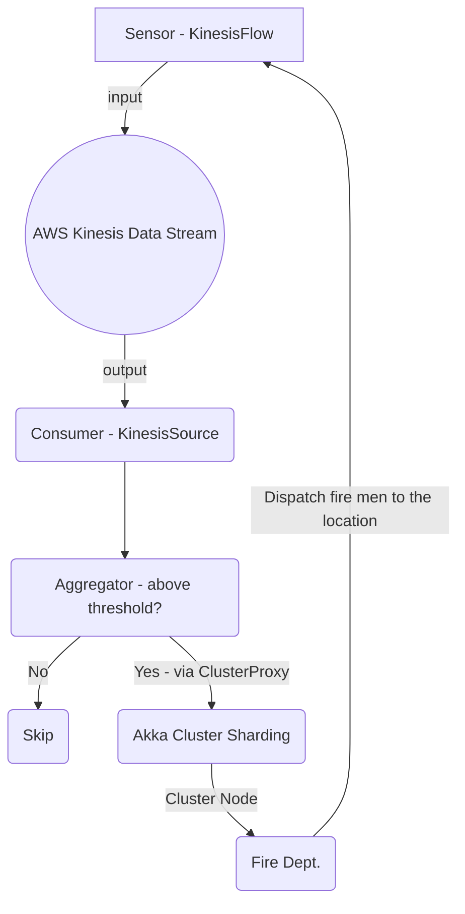

# Fire Alert System


The number of home fires in the USA per year is roughly 358,500 according to Google. In 2020 rate of 7.2 deaths per 1,000 reported home fires was recorded. This walk-through illustrates an attempt to mitigate this problem with `Akka.Streams.Kinesis`. We will be creating a fire alert system to enable faster response from the Fire Department. The sensors will publish sensor readings into Kinesis which will be consumed by a service deployed as container. The role of this service is to analyze the sensor reading for potential fire breakout and publish fire alert message to be consumed by by ALL fire department systems and have the nearest fire station respond to the ALERT!

## Data Flow

    - SensorData is published on Kinesis using the SensorActor via KinesisFlow
    - The SensorData is received at the consumer end via KinesisSource inside the ShardActor. 
      The message is forwarded to the AggregatorActor, responsible for applying threshold rule on the received reading. 
      If the reading is above a given threshold, Fire departments are alerted!
    - The fire department receive the alert via deployed cluster node and fire men are dispatched to the location of the incidence!

This is a reference architecture for [Akka.NET](https://getakka.net/), intended to illustrate the following Akka.NET techniques and principles:

1. [Akka.Streams.Kinesis](https://github.com/akkadotnet/Alpakka/tree/dev/src/AWS/Kinesis) - Akka.Streams.Kinesis can be used to either put data directly to AWS Kinesis streams (using KinesisFlow or KinesisSink) or reading from it (using KinesisSource).
2. [Akka.Cluster](https://getakka.net/articles/clustering/cluster-overview.html) - a module that allows Akka.NET developers to create horizontally scalable, peer-to-peer, fault-tolerant, and elastic networks of Akka.NET actors.
3. [Akka.Cluster.Sharding](https://getakka.net/articles/clustering/cluster-sharding.html) - a fault-tolerant, distributed tool for maintaining a single source of truth for all domain entities. 
4. [Akka.Bootstrap.Docker](https://github.com/petabridge/akkadotnet-bootstrap/tree/dev/src/Akka.Bootstrap.Docker) - this sample uses Docker and `docker-compose` to run the sample, and Akka.Bootstrap.Docker is used to inject runtime environment variables into the Akka.NET HOCON configuration at run-time.

## Goals
To demonstrate how to solve a real-world problem with technology built on top of **Akka.Streams.Kinesis** and AWS Kinesis. The application will consist of the following:

- **Kinesis Data Stream Service**: This for capturing sensor data streams from multiple devices.
- **Sensor Simulator**: Since we can’t use a real world device, the simulator will act as the real world device be generating random sensor data. **Akka.Streams.Kinesis Source** will be responsible for generating and feeding these data into Kinesis.
- **The consumer/API service**: This component will be responsible for consuming sensor data from Kinesis. Here is were we can apply configured rules for determining when to send Fire Alert messages to all subscribed/active fire department service. The service very simple: check the received reading if goes above the set threshold then publish fire alert else discard - we are not storing any data.
- **Fire department service**: This is responsible for consuming Fire Alert messages and to determine how close (calculated from the **Lat/Long** in the message) the current station is from the fire incident. This will be kept very simple.

## What Is Amazon Kinesis?
Amazon Kinesis makes it easy to collect, process, and analyze real-time, streaming data so you can get timely insights and react quickly to new information, and also provides the ability for you to build custom applications based on your use-case needs.

## Sensor Simulator
The [SensorActor.cs](src/KinesisProducer/SensorActor.cs) acts as a digital copy of a physical temperature sensor, responsible for creating and pushing `SensorData` to AWS Kinesis:
```csharp
    public class SensorActor:ReceiveActor
    {
        private ICancelable _job;
        private readonly SensorSetting _setting;
        private readonly Random _random;
        private readonly Func<IAmazonKinesis> _clientFactory;
        private IActorRef _source;
        private readonly ILoggingAdapter _log;
        public SensorActor(string sensor, IMaterializer materializer)
        {
            _log = Context.GetLogger();
            _clientFactory = () => new AmazonKinesisClient(
                new BasicAWSCredentials(Environment.GetEnvironmentVariable("accessKey"),
                Environment.GetEnvironmentVariable("accessSecret")),
                RegionEndpoint.USEast1);

            _random = new Random();
            var sensorInfo = sensor.Split(",");
            _setting = new SensorSetting
            {
                SensorName = sensorInfo[2],
                Latitude = double.Parse(sensorInfo[0]),
                Longitude = double.Parse(sensorInfo[1]),
            };
            _source = Source.ActorRef<SensorData>(1000, OverflowStrategy.Fail)
             .Select(data => new PutRecordsRequestEntry
             {
                 PartitionKey = _random.Next().ToString(),
                 Data = new MemoryStream(Encoding.UTF8.GetBytes(JsonSerializer.Serialize(data)))
             })
             .Via(KinesisFlow.Create(Environment.GetEnvironmentVariable("streamName"), KinesisFlowSettings.Default, _clientFactory))
             .To(Sink.ActorRef<PutRecordsResultEntry>(Self, "done"))
             .Run(materializer);

            _job = Context.System.Scheduler.Advanced
                .ScheduleRepeatedlyCancelable(TimeSpan.FromSeconds(5), TimeSpan.FromSeconds(1),
                () =>
                {
                    var sensorData = new SensorData
                    {
                        SensorName = _setting.SensorName,
                        SensorId = _setting.SensorId,
                        Coordinate = new Coordinate
                        {
                            Latitude = _setting.Latitude,
                            Longitude = _setting.Longitude
                        },
                        Reading = _random.Next(75, 1000)
                    };
                    _source.Tell(sensorData);
                });
            Receive<PutRecordsResultEntry>(re =>
            {
                _log.Info(JsonSerializer.Serialize(re));
            });
        }
```

## Kinesis Consumption
The [ShardActor.cs](src/KinesisSample/ShardActor.cs) connects to AWS Kinesis, reads the sensor readings per `shardid` and pushes the data read to the [Aggregator.cs](KinesisSample/AggregatorActor.cs). The `AggregatorActor` is responsible for determinining whether to alert fire departments via Akka.Cluster ClusterProxy!

```csharp
    public class ShardActor: ReceiveActor
    {
        private IActorRef _aggregator;
        private readonly ILoggingAdapter _log;
        public ShardActor(IActorRef aggregator, Shard shard, Func<IAmazonKinesis> clientFactory, string streamName, IMaterializer materializer)
        {
            _log = Context.GetLogger();
            _aggregator = aggregator;  
            var shardSetting = new ShardSettings(streamName, shard.ShardId, ShardIteratorType.AT_TIMESTAMP,
                   TimeSpan.FromSeconds(1), 10000, atTimestamp: DateTime.MinValue);
            var graph = KinesisSource.Basic(shardSetting, clientFactory)
                .Select(x => x)
                .To(Sink.ActorRef<Record>(Self, "done"))
                .Run(materializer);
            Receive<Record>(s => 
            {
                var sdata = JsonSerializer.Deserialize<SensorData>(Encoding.UTF8.GetString(s.Data.ToArray()));
                _aggregator.Tell(sdata);
            });
            Receive<string>(s => 
            {
                _log.Info(s);
            });
        }
    }
```
```csharp
    public sealed class AggregatorActor:ReceiveActor
    {
        private readonly IActorRef _clusterProxy;
        private readonly int _alertThreshold;
        private readonly ILoggingAdapter _log;
        public AggregatorActor(ActorSystem system)
        {
            _log = Context.GetLogger();
            _alertThreshold = int.Parse(Environment.GetEnvironmentVariable("threshold"));
            var sharding = ClusterSharding.Get(system);

            _clusterProxy = sharding.StartProxy(
                typeName: "SensorData",
                role: "node",
                messageExtractor: new FireAlertMessageExtractor());
            Receive<SensorData>(sd =>
            {
                var sdata = sd;
                if(sdata.Reading > _alertThreshold)
                {
                    var alert = new FireAlert(sd.Coordinate, sd.Reading, Level(sd.Reading));
                    _clusterProxy.Tell(new ShardEnvelope("SensorData", alert));
                    _log.Info($"RECEIVED: READING `{sdata.Reading}` from {sdata.SensorName} location: {sdata.Coordinate.Latitude},{sdata.Coordinate.Longitude}");
                }
                
            });
        }
```

## Fire Department
The [DepartmentActor.cs](src/KinesisFireDepartment/Actors/DepartmentActor.cs) acts as the node in the cluster representing each Fire Departments. The `DepartmentActor` receives `SensorData` via `Akka.Cluster.Sharding`

```csharp
    public class DepartmentActor : ReceiveActor
    {
        private readonly List<DepartmentOnline> _departmentsCoordinates = new List<DepartmentOnline>();
        private readonly ILoggingAdapter _log;
        private readonly string _name;  
        public DepartmentActor()
        {
            _name = Environment.GetEnvironmentVariable("name"); 
            _log = Context.GetLogger();
            Receive<FireAlert>(f =>
            {
                _log.Info($"{_name} RECEIVED =>>>> {JsonSerializer.Serialize(f)}");
            });
            Receive<DepartmentOnline>(f =>
            {
                if (!_departmentsCoordinates.Contains(f))
                {
                    _departmentsCoordinates.Add(f);
                    _log.Info($"Department added: {JsonSerializer.Serialize(f)}");
                }
                else
                    _log.Info($"Department already added: {JsonSerializer.Serialize(f)}");
            });
        }
    }
```
## Running The Sample
The sample can be run easily using Docker and `docker-compose`. You'll want to make sure you have [Docker for Windows](https://docs.docker.com/docker-for-windows/) installed with Linux containers enabled if you're running on a Windows PC.

1. Install [AWS CLI](https://docs.aws.amazon.com/cli/latest/userguide/getting-started-install.html) if you have not. 
   
2. Create an AWS `accesskey` and `accessSecret` - which grants programmatic access to your resources. Guard them carefully! You will need to create an IAM user, if you have not! The [To create an IAM user](https://docs.aws.amazon.com/streams/latest/dev/tutorial-stock-data-kplkcl-iam.html) section at the bottom of the page guides you through the process!

3. Clone this repository and run the [`build.cmd` script](build.cmd) in the root of this repository.

4. Create Kinesis Data Streams
   - Configure AWS CLI: `aws configure` see [Configuration basics](https://docs.aws.amazon.com/cli/latest/userguide/cli-configure-quickstart.html)
   - run `aws cloudformation create-stack --template-body file://kinesis.yaml --stack-name fire-alert` to deploy kinesis data stream
      `kinesis.yaml
      ```yaml
        AWSTemplateFormatVersion: '2010-09-09'
        Resources:
          AkkaStream:
            Type: AWS::Kinesis::Stream
            Properties:
              Name: fire-alert
              RetentionPeriodHours: 168 
              ShardCount: 5
      ```
      The config above will create a single resource/instance of Kinesis.

      ```yaml
        AWSTemplateFormatVersion: '2010-09-09'
        Resources:
          AkkaStream:
            Type: AWS::Kinesis::Stream
            Properties:
              Name: fire-alert
              RetentionPeriodHours: 168 
              ShardCount: 5
          AkkaStream2:
            Type: AWS::Kinesis::Stream
            Properties:
              Name: fire-alert-2
              RetentionPeriodHours: 168 
              ShardCount: 5
      ```
      The config above will create two resources/instances of Kinesis. And the value of `Name` property is the `streamName` below!
5. Update the `docker-compose.yaml` with your `accessKey` and `accessSecret`:

	```
	version: '3.4'
	x-common-variables: &common-variables
	   accessKey: ""
	   accessSecret: ""
	   ACTORSYSTEM: "FireAlert"
	   streamName: "fire-alert" 
	   CLUSTER_SEEDS: "[akka.tcp://FireAlert@light-house-1:4053,akka.tcp://FireAlert@light-house-2:4054]"
	```
6. Build the images
	```
	PS> ./build.cmd docker
	```

	The `docker` build stage will create four Docker images locally:

	* `kinesissample`
	* `kinesisfiredepartment`
	* `kinesisproducer`
	* `clusterlighthouse`

	All of these Docker images will be tagged with the `latest` tag and the version number found at the topmost entry of [`RELEASE_NOTES.md`](RELEASE_NOTES.md).

7. From there, we can start up all the services via `docker-compose`:

	```
	PS> docker-compose up
	```
